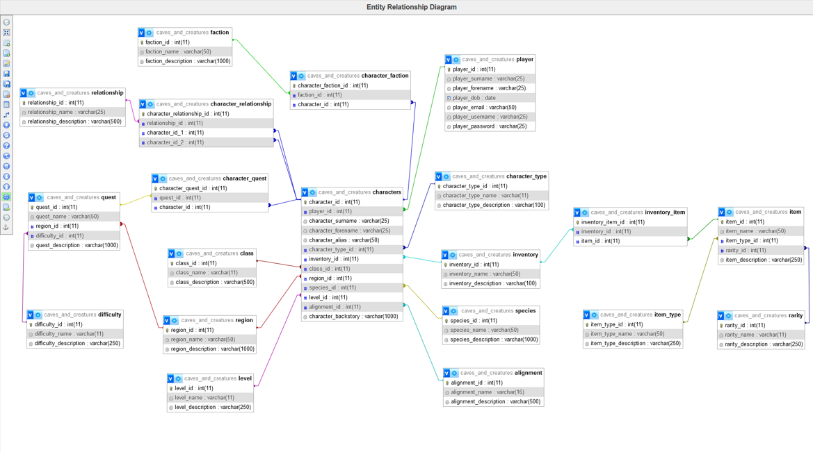

# Caves and Creatures

By Dean Coles

## Video Overview
https://youtu.be/vAjXVgTBDAQ

## Scope
Caves and Creatures database is designed to support a tabletop role-playing game. The aim of the database is to store and manage a wide range of gameplay elements including players, characters, items, quests, factions, and relationships. The database supports player-controlled and non-player characters, item inventories, quest tracking, and world-building through regions, classes, species, and alignments.

This system was designed to mirror the richness of tabletop RPGs, allowing structured queries to retrieve player data, character backgrounds, active quests, inventories, and more. It is optimised to allow for future expansion, including additional character development systems or campaign tracking.

## Scope

The database includes the following key areas:

* Player Management: Tracks player details, usernames, passwords, and related characters.
* Character Development: Stores character names, aliases, types, classes, alignments, species, levels, regions, inventories, and backstories.
* Inventory System: Manages the relationship between characters and their items using inventories and item types.
* Quest Tracking: Allows characters to be associated with quests, each with a difficulty and regional setting.
* Social Worldbuilding: Captures factions, character-faction affiliations, and inter-character relationships.

Excluded from the scope:

* In-game mechanics (e.g. battle systems, dice rolls)
* Payment or subscription handling
* Real-time gameplay tracking

## Entities

The key entities include:

* player: Represents users who control player characters.
* characters: The primary unit of gameplay, connected to many other tables.
* character_type: Defines whether a character is player-controlled or an NPC.
* class, species, alignment, level, region: World-building dimensions that define a character's attributes.
* inventory, inventory_item, item, item_type, rarity: Used to store and categorise items that characters can possess.
* quest, difficulty: Quests and their associated challenge levels.
* faction, character_faction: Allows many-to-many relationships between characters and organisations.
* relationship, character_relationship: Defines interpersonal relationships between characters.

#### Relationships

The following relationships are present in the system:

* One-to-Many:
    * One player has many characters
    * One class, species, level, etc. is linked to many characters
* Many-to-Many:
    * Characters can belong to multiple factions via character_faction
    * Characters can participate in multiple quests via character_quest
    * Characters can relate to other characters via character_relationship

All foreign keys are properly enforced to maintain referential integrity.

* As detailed by the diagram:
    * One player can have 0 to many characters. A character must be linked to exactly one player unless it is a non-player character (NPC).
    * One character is assigned to exactly one class, species, level, alignment, region, inventory, and character type.
    * Each character can be part of 0 to many factions, and each faction can contain multiple characters. This is managed through a junction table (character_faction).
    * Each character can take part in 0 to many quests, and each quest can be completed by multiple characters. This is managed through a junction table (character_quest).
    * Each character can form 0 to many relationships with other characters via character_relationship, which uses the relationship table to define the type (e.g., ally, rival).
    * Each item exists in one of the defined item_type and rarity categories. Items are stored in inventories, which are assigned to characters.
    * Quests are tied to specific regions and difficulties.

#### Optimisations

* Normalisation: All tables are normalised to at least 3NF. This reduces redundancy and increases maintainability.
* Indexed Keys: All primary keys are indexed, and foreign keys are used to speed up joins between large tables.
* Descriptive Naming: Field names are descriptive, improving clarity and maintainability.
* Use of Junction Tables: Many-to-many relationships (such as characters to factions or quests) are handled via dedicated tables (character_faction, character_quest).

#### Limitations

* Gameplay metrics such as health, mana, skill trees, and combat stats are not currently tracked.
* The game logic (e.g. combat rules, ability effects) must be handled at the application level.
* Inventory is limited to item possession and does not include quantities or equipment slots.
* The game logic (e.g. combat rules, ability effects) must be handled at the application level.
